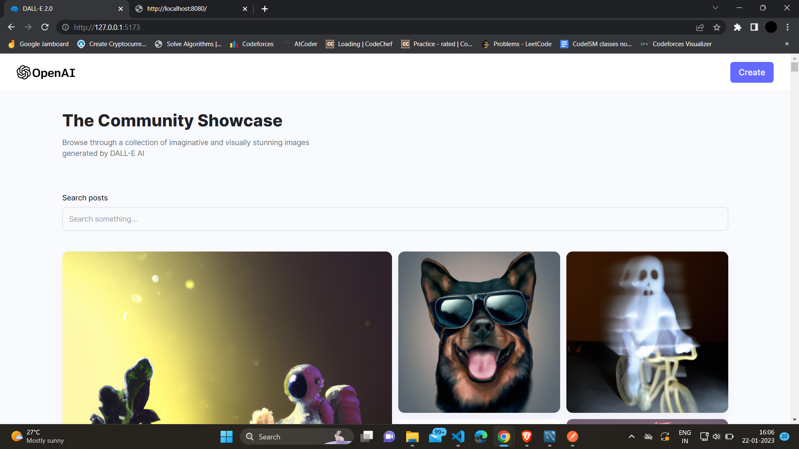
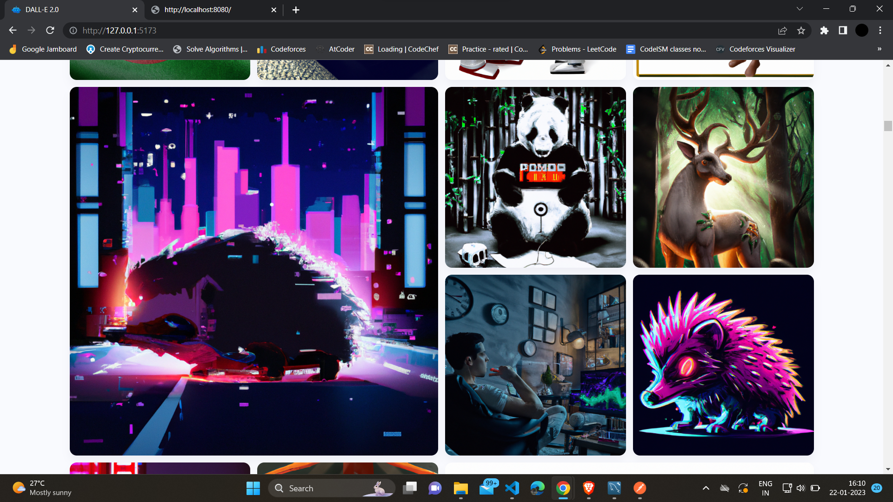
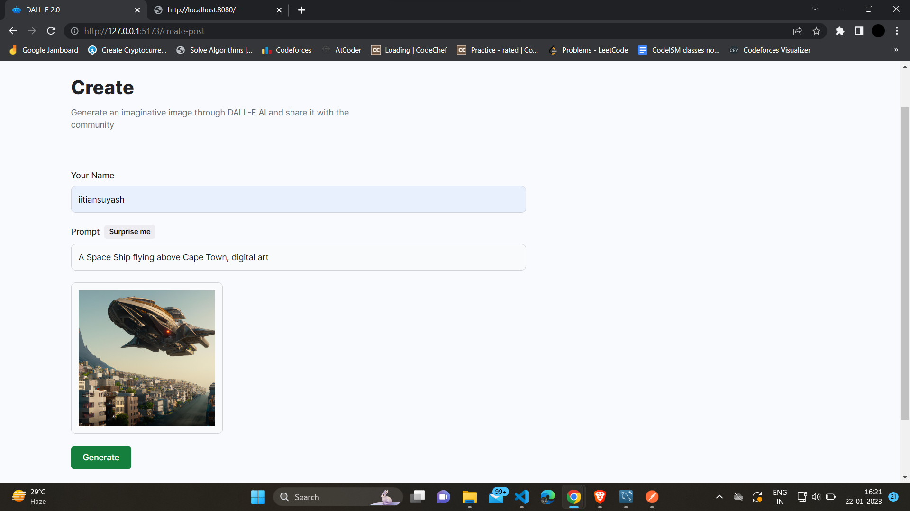
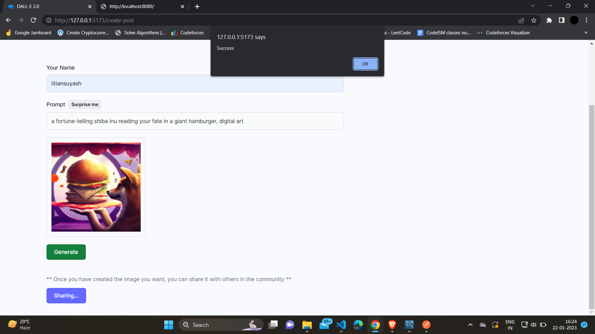
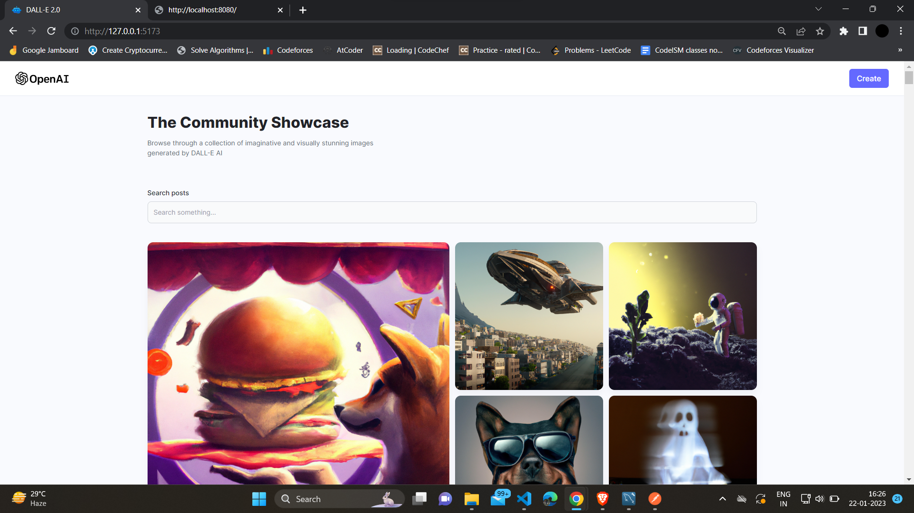

# AI Image Generation App using DALL-E 2.0

This is a simple app that uses the DALL-E 2.0 model to generate images from text prompts. 

## How to use

1. Clone this repository
2. Install the requirements
3. Run the app

## How to install the requirements and start the servers

Server 1 : 

```bash
$cd client
$npm install
$npm run dev
```

Server 2 : 

```bash
$cd server
$npm install
$npm start
```

## DEMO












## References

- [DALL-E 2.0](https://openai.com/blog/dall-e/)
- [OpenAI](https://openai.com/)


<p style="text-align:center;">
    Made with ❤️ by iitiansuyash
</p>